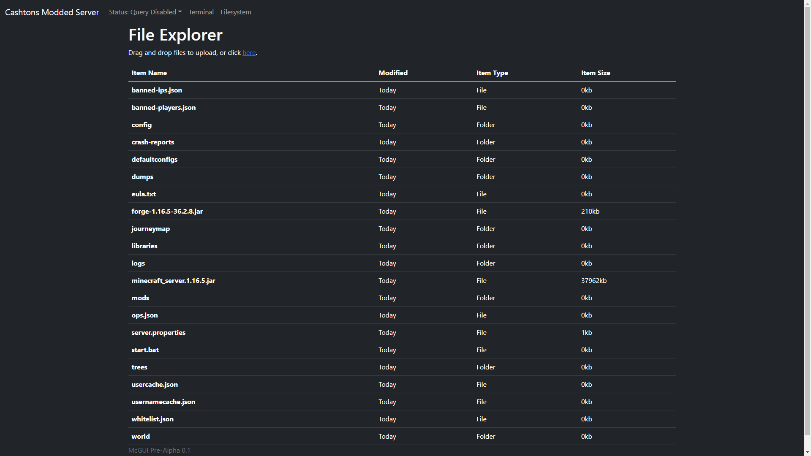

# McGUI
A web based graphical user interface for Minecraft server
admins.

[Changelog](/changelog.md)

## Working Features
- Server power controls
- Server file explorer
- Player Viewer
- Server Console with command sending support
- API

## What needs work
- File Uploading
- Mod Support
- Plugin Support
- Specific features for server version (forge, bukkit
etc.)
- Anything else I think of

## Images

